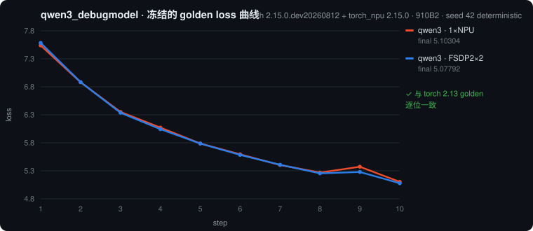
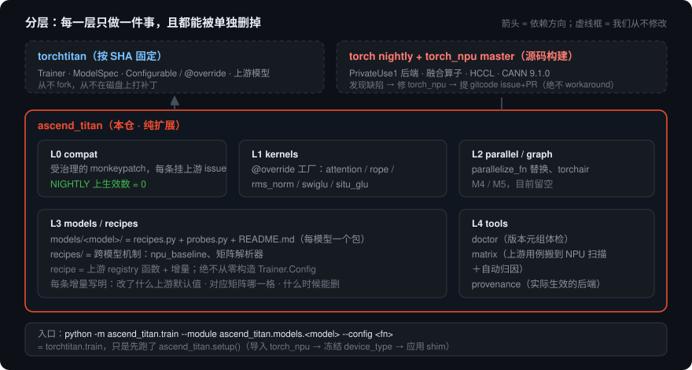
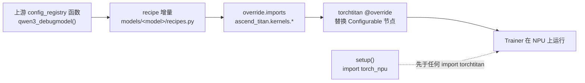

<div align="center">


<p>
  <a href="LICENSE"></a>
  
  
  
  
  
  
</p>

**[torchtitan](https://github.com/pytorch/torchtitan) 的昇腾 NPU 树外扩展。**
装在一个按 commit 固定的 torchtitan 旁边，上游模型就能在 NPU 上训练；
昇腾融合算子、并行策略、图模式按 recipe 选择性开启。
**torchtitan 本身从不 fork、从不在磁盘上打补丁。**

[快速开始](#-快速开始) · [模型支持](#-模型支持) · [特性支持](#-特性支持) · [架构](#-架构) ·
[我们怎么处理上游问题](#-我们怎么处理上游问题) · [文档](#-文档)

</div>

---

## 现在是什么状态

> **NIGHTLY 基线（2026-08-30）** —— torch nightly `2.15.0.dev20260812` + torch_npu master 源码构建 + torchtitan `13da2d77c`。

| 结论 | 证据 |
|---|---|
| **不加任何 shim**，qwen3 单卡 / FSDP2×2 的 loss 与 torch 2.13 golden **逐位一致** | `ASCEND_TITAN_SKIP_SHIMS=1 ./scripts/check_golden.sh` → `GOLDEN MATCH` |
| **零 override 的上游 llama3** 在昇腾上训练（复数 RoPE + ChunkedLoss + spmd_types 全默认） | `step: 10  loss:  4.01820  grad_norm:  1.7382`（seed 42 + deterministic，可复现） |
| 剩下 6 个昇腾侧缺口 **全部在 torch_npu / op-plugin 修好并带 UT**，已提 gitcode issue + PR | [下表](#-我们怎么处理上游问题) |
| NPU / CANN 归因的红格 | **0** |

<div align="center">

</div>

---

## 🚀 快速开始

<details open>
<summary><b>NIGHTLY（默认，也是唯一门禁 track）</b></summary>

```bash
git clone https://github.com/JavaZeroo/ascend-torchtitan.git && cd ascend-torchtitan

# 1. torch nightly（日期取自 torch_npu master 的 requirements_2.15.txt）
pip install --pre -c constraints/nightly.txt torch \
    --index-url https://download.pytorch.org/whl/nightly/cpu

# 2. torch_npu：master 源码构建（约 9 分钟，必须在本地盘上构建）
source /usr/local/Ascend/cann-9.1.0/set_env.sh
./scripts/build_torch_npu.sh                       # → /opt/wheels/torch_npu-*.whl + 元数据 json

# 3. torchtitan（固定 SHA）+ 本包
TORCH_NPU_WHEEL=$(ls -t /opt/wheels/torch_npu-*.whl | head -1) \
WITH_TORCH=1 TITAN_DIR=../torchtitan ./scripts/install.sh

# 4. 体检
ascend-titan-doctor                                # 版本元组 + 缺失项 + autoload 情况
```

</details>

<details>
<summary><b>RELEASE track（PyPI 的 torch_npu，信息性）</b></summary>

```bash
```

正式版 torch 需要 2 条 compat shim。**只在正式版上出现、nightly 上不存在的问题不算问题**（P8）：
不写 shim、不写补丁、不记 issue。

</details>

### 跑起来

```bash
# 参考路径：qwen3 debugmodel，单卡 10 步
ASCEND_RT_VISIBLE_DEVICES=0 NPU=1 \
MODULE=ascend_titan.models.qwen3 CONFIG=qwen3_debugmodel_npu ./scripts/run_train.sh

# 零 override 的上游 llama3
NPU=1 MODULE=ascend_titan.models.llama3 CONFIG=llama3_debugmodel_stock_npu ./scripts/run_train.sh

# 与冻结的 golden 逐位对比（自动加 --debug.seed 42 --debug.deterministic）
ASCEND_RT_VISIBLE_DEVICES=0 NPU=1 ./scripts/check_golden.sh qwen3_debugmodel_npu

# 把上游 61 个集成用例整体搬到 NPU 上扫描（含自动归因）
python -m ascend_titan.tools.matrix --cards 0-7 --jobs 4
```

`python -m ascend_titan.train` 等价于 `python -m torchtitan.train`，只是先执行了
`ascend_titan.setup()`（导入 torch_npu → 让 torchtitan 冻结出正确的 `device_type` → 应用 shim）。
其余全部是上游代码。

### 自己决定用哪些昇腾内核

recipe 是**我们验证过的预设**，不是唯一入口。同一个模型有三条路，都不用改代码：

```bash
# ① 预设：我们跑过 golden、记过性能的组合
MODULE=ascend_titan.models.qwen3_5 CONFIG=qwen35_0_8b_npu NPU=1 ./scripts/run_train.sh

# ② 预设 + 自己挑内核。--override.imports 是**整体替换**，所以既能加也能减：
#    这里保留昇腾融合注意力、去掉 GDN override、再加上融合 RMSNorm
MODULE=ascend_titan.models.qwen3_5 CONFIG=qwen35_0_8b_npu NPU=1 ./scripts/run_train.sh \
    --override.imports ascend_titan.kernels.attention.npu_fusion_attention \
                       ascend_titan.kernels.rms_norm.npu_rms_norm
#    一个 override 都不要（但保留 recipe 的数据/并行/资产设置）：
#    ... ./scripts/run_train.sh --override.imports

# ③ 完全的上游原生（不加任何我们的东西，用来做对照）
MODULE=ascend_titan.recipes.matrix NPU=1 ./scripts/run_train.sh \
    CONFIG=torchtitan.models.qwen3_5.config_registry__qwen35_0_8b__stock
```

可用的 override 目标就是 `ascend_titan/kernels/__init__.py` 里的 `*_OVERRIDE` 常量；
`ascend-titan-provenance --module <m> --config <c>` 打印某个组合**实际**生效了哪些昇腾节点。

注意力后端（flex / varlen）是 `model_spec` 的构造参数、不在 CLI 暴露面上，所以另有一条入口：
`npu_fusion_attention_from_flex` 直接把上游原生的 FlexAttention 节点换成昇腾内核，
于是"上游原生配置 + 昇腾注意力"也只是一条命令（实测单卡 3 步 loss 7.63 → 6.43，tps 47,383）：

```bash
MODULE=ascend_titan.recipes.matrix NPU=1 ./scripts/run_train.sh \
    CONFIG=torchtitan.models.qwen3.config_registry__qwen3_debugmodel__stock \
    --override.imports ascend_titan.kernels.attention.npu_fusion_attention_from_flex
```

它只认领解码器层的注意力节点（`fqns=["*layers.*.attention.inner_attention"]`）——
多模态模型的视觉塔喂的是 BlockMask，这个内核吃不了，所以那些节点保持 flex 不动。

---

## 🧩 模型支持

一个模型一个包：`ascend_titan/models/<model>/` = `recipes.py`（支持的入口）+ `probes.py`（只做测量）+ **`README.md`（完整使用指南）**。
新增模型从 `models/_template/` 复制。总览与流程：**[`ascend_titan/models/README.md`](ascend_titan/models/README.md)**。

| 模型 | 状态 | recipe | 指南 | 说明 / 阻塞 |
|---|:--:|---|:--:|---|
| **Qwen3** | 🟢 | `models/qwen3` | [📖](ascend_titan/models/qwen3/README.md) | **release 级**：0.6B 真实尺寸，R1–R8 全绿（单卡/FSDP2×8/TP2/PP2、golden 逐位、500 步长稳、checkpoint 与 HF 往返、性能基线带 provenance） |
| **Llama 3** | 🟡 | `models/llama3` | [📖](ascend_titan/models/llama3/README.md) | **零 override** 的上游路径；上游 features 并行套件也跑在它上面。只有 debugmodel，R1–R8 未取 |
| **Qwen3.5** | 🟡 | `models/qwen3_5` | [📖](ascend_titan/models/qwen3_5/README.md) | 语言侧 0.8B 能训：单卡 12.88826 → 8.14589、FSDP2×8 → 8.06005；语言侧与多模态 debugmodel 的 golden 都已冻结；纯文本增量导致 DCP 续训缺视觉塔的优化器状态；GDN 无融合算子 |
| **Kimi K3** | 🟡 | `models/kimi_k3` | [📖](ascend_titan/models/kimi_k3/README.md) | 多模态 + KDA + MoE，单卡 10 步 loss 4.56418，golden 已冻结；R1–R8 未取 |
| **DeepSeek-V3** | 🟡 | 矩阵覆盖 | — | MoE + EP（fsdp+ep、hsdp+ep）🟢；`fused_mla_swiglu` = OURS-9，MTP = DEP-HELION |
| **GPT-OSS** | 🟡 | 矩阵覆盖 | — | `pp+fsdp+ep+sacop` 🟢（attention sinks 的 LSE 尾部已实现）；`fsdp+tp+ep` = OURS-10 |
| **Kimi K2.7** | 🟡 | 矩阵覆盖 | — | muon / MoE 用例覆盖；DistMuon 是 CUDA-only |
| **Muse Glimmer** | 🟡 | 矩阵覆盖 | — | text 变体覆盖；mm 变体走 CP，停在 DEP-INDUCTOR |
| **Flux** | ⚪ | — | — | 扩散模型，尚未评估 |

🟢 **release 级**——[`docs/model-release-criteria.md`](docs/model-release-criteria.md) 的 R1–R8
每条都有记录下来的命令与输出 · 🟡 能跑但有缺口（缺口必须列出来）· 🔴 阻塞（必须写归因）· ⚪ 未评估。
"没测"和"测了不行"永远不共用一格（P2）。`python -m ascend_titan.models.registry` 打印这张表
和逐条判据表。

---

## ⚙️ 特性支持

<table>
<tr><th align="left">并行</th><th align="center">NIGHTLY</th><th align="left">备注</th></tr>
<tr><td>FSDP2 / HSDP / DDP</td><td align="center">🟢</td><td>含 reshard_always、梯度累积、bf16 优化器状态</td></tr>
<tr><td>TP + SP（含无 SP）</td><td align="center">🟢</td><td></td></tr>
<tr><td>PP：1F1B / GPipe / looped / PP+DP+TP</td><td align="center">🟢</td><td></td></tr>
<tr><td>EP（专家并行，MoE）</td><td align="center">🟢</td><td>deepseek_v3、gpt_oss</td></tr>
<tr><td>CP（上下文并行）</td><td align="center">🟡</td><td>CP 在 nightly 上消失；现停在 <code>DEP-INDUCTOR</code>（未装 Triton-Ascend）</td></tr>
<tr><td><code>spmd_types</code> 后端（上游默认）</td><td align="center">🟢</td><td>上游默认，直接可用</td></tr>
</table>

<table>
<tr><th align="left">算子 / 组件</th><th align="center">NIGHTLY</th><th align="left">实现</th></tr>
<tr><td>varlen 注意力（昇腾融合）</td><td align="center">🟢</td><td><code>npu_fusion_attention</code>（TND + <code>sparse_mode=3</code>），包成 <code>custom_op</code> 以便 compile</td></tr>
<tr><td>varlen 注意力（上游 stock）</td><td align="center">🟢</td><td>靠 <b>NPU-1</b> 修复：为 PrivateUse1 注册 <code>aten::_flash_attention_forward/_backward</code></td></tr>
<tr><td>RoPE：ComplexRoPE / CosSinRoPE</td><td align="center">🟢</td><td>实数缓存实现 + <code>npu_rotary_mul</code>；stock 复数索引靠 <b>NPU-3</b></td></tr>
<tr><td>RMSNorm / SwiGLU（融合）</td><td align="center">🟢</td><td><code>npu_rms_norm</code> / <code>npu_swiglu</code>（性能 recipe，非 baseline）</td></tr>
<tr><td>ChunkedLossWrapper（上游默认）</td><td align="center">🟢</td><td><b>参考 recipe 的默认</b>，golden 门禁覆盖；TT-4 只在正式版 torch 上出现</td></tr>
<tr><td>SiTU-GLU（Kimi K3）</td><td align="center">🟡</td><td>ops-nn <code>aclnnSituGlu</code> 已封装；等模型包能 import</td></tr>
<tr><td><code>torch.compile</code> / flex attention</td><td align="center">🔴</td><td><code>DEP-INDUCTOR</code>：需要 Triton-Ascend（M5）</td></tr>
<tr><td>fake_backend 干跑（单卡模拟多卡）</td><td align="center">🟢</td><td>靠 <b>NPU-2</b> 修复</td></tr>
</table>

完整矩阵（61 个上游用例逐格结果 + 归因）：**[`docs/capability-matrix.md`](docs/capability-matrix.md)**。

---

## 🏗 架构

<div align="center">

</div>



| 层 | 包 | 机制 |
|---|---|---|
| **L0** compat | `ascend_titan.compat` | 受治理的 monkeypatch，每条挂上游 issue —— **NIGHTLY 上生效数 = 0** |
| **L1** kernels | `ascend_titan.kernels` | torchtitan `@override` 工厂；`_probe.py` 做依赖探测（torch_npu 硬依赖，P14） |
| **L2** parallel / graph | `ascend_titan.parallel`、`.graph` | `ModelSpec.parallelize_fn` 替换、torchair 后端（M4/M5） |
| **L3** models / recipes | `ascend_titan.models.<model>`、`ascend_titan.recipes` | 内容在 `models/`（每模型一个包 + README，逐条写出自己的增量），机制在 `recipes/`（`deltas.py` 原语、`matrix.py` 矩阵解析器与它的 `npu_minimal` / `npu_fused`） |
| **L4** tools | `ascend_titan.tools` | `doctor`、矩阵扫描与归因、provenance |

---

## 🔧 我们怎么处理上游问题

**红线：发现 torch_npu 的问题，只能修，不能绕**（P1 / P9）。
在本仓任何位置（recipe、baseline、shim、"换个 loss"）绕过 torch_npu 缺陷都是违规。
流程：最小复现 → 在 torch_npu / op-plugin 上修 + 写 UT → 源码重建 → 在 NPU 上验证 → 存 format-patch → 提 issue + PR → 合入后删补丁、升 SHA。

**边界（P10）**：只操作 `gitcode.com/ascend/*`。`github.com/pytorch/*` **只读**——不提 issue、不提 PR、不评论；
torchtitan / pytorch 侧的修复方案只作为证据存 `patches/evidence/`，永不应用。

2026-08-30 提交的六个修复：

| ID | 问题 | 仓库 | issue / PR |
|---|---|---|---|
| NPU-1 | `aten::_flash_attention_forward/_backward` 没有 NPU 内核 | Ascend/pytorch | [#4439](https://gitcode.com/Ascend/pytorch/issues/4439) / [!45527](https://gitcode.com/Ascend/pytorch/merge_requests/45527) |
| NPU-2 | fake 进程组后端不接受 npu 张量 | Ascend/pytorch | [#4438](https://gitcode.com/Ascend/pytorch/issues/4438) / [!45526](https://gitcode.com/Ascend/pytorch/merge_requests/45526) |
| NPU-7 | torch 2.15 下 inductor `make_reduction` 缺 `strict_reduction` | Ascend/pytorch | [#4440](https://gitcode.com/Ascend/pytorch/issues/4440) / [!45528](https://gitcode.com/Ascend/pytorch/merge_requests/45528) |
| NPU-8 | 自动加载拖入 fsdp，`spmd_types` 循环导入 | Ascend/pytorch | [#4441](https://gitcode.com/Ascend/pytorch/issues/4441) / [!45529](https://gitcode.com/Ascend/pytorch/merge_requests/45529) |
| NPU-3 | `aclnnIndex` 不支持复数（复数高级索引 161002） | Ascend/op-plugin | [#466](https://gitcode.com/Ascend/op-plugin/issues/466) / [!5800](https://gitcode.com/Ascend/op-plugin/merge_requests/5800) |
| NPU-6 | `zero_` 不支持 uint16/32/64（`aclnnInplaceZero` 161002） | Ascend/op-plugin | [#467](https://gitcode.com/Ascend/op-plugin/issues/467) / [!5801](https://gitcode.com/Ascend/op-plugin/merge_requests/5801) |

状态以 [`docs/issues/STATUS.md`](docs/issues/STATUS.md) 为准（P11：单一事实来源）。

---

## 🛠 开发

```bash
pytest tests/unit -x            # CPU 单测（不需要 NPU）
ruff check . && ruff format --check .
./scripts/probe_compat.sh       # torchtitan 固定点最远能前进到哪个 commit
python -m ascend_titan.models.registry   # 模型支持表
```

几条会被评审引用的硬规则：

- **基础依赖硬导入**（P14）：`torch` / `torch_npu` / `torchtitan` 绝不 `try: import`，缺了就报错。
  静默降级会把"环境装错了"变成一次安静的 eager 运行——绿的但测的不是我们要测的东西，比红的更糟。
- **先用配置，再打补丁**（P0）：上游有开关就用开关。
- **recipe 是增量**：调用上游 registry 函数再改结果，绝不从零构造 `Trainer.Config`。
- **baseline 最小化**（P12）：只允许"不加就跑不起来"的增量，每条挂 issue ID 和**消失条件**。
- **验证先于断言**（P13）：任何 🟢 / "已修复" 都要附命令与输出，且在 NIGHTLY 上跑过。

完整原则：[`docs/PRINCIPLES.md`](docs/PRINCIPLES.md)（P0–P14）。与 Claude Code 协作：[`CLAUDE.md`](CLAUDE.md)、`.claude/skills/`。

---

## 📚 文档

| | |
|---|---|
| [原则 P0–P14](docs/PRINCIPLES.md) · [ADR](docs/adr/) | 评审按编号引用；ADR-006 定义 NIGHTLY，ADR-007 定义硬依赖 |
| [能力矩阵](docs/capability-matrix.md) · [基线](docs/baseline.md) | 每个特性的 🟢/🔴/⚪ 与已验证的版本元组 |
| [问题状态](docs/issues/STATUS.md) · [上游追踪](docs/upstream-tracking.md) | 单一事实来源；shim 的到期条件 |
| [模型总览](ascend_titan/models/README.md) · [路线图](docs/roadmap.md) · [术语表](docs/glossary.md) | |

---

<div align="center">

Apache-2.0 · 上游 [pytorch/torchtitan](https://github.com/pytorch/torchtitan) ·
昇腾 [Ascend/pytorch](https://gitcode.com/Ascend/pytorch)、[Ascend/op-plugin](https://gitcode.com/Ascend/op-plugin)

</div>
