# shim 与 override：机制设计

> 修订 2026-09-02。取代 `docs/shim-override-architecture.html`（旧版只讲了"怎么写"，
> 没讲"什么时候不该写"和"怎么让它消失"）。
> 依据：`docs/PRINCIPLES.md` P0–P14、`docs/adr/ADR-001..007`，以及 2026-08 至 09
> 的实测经验——**本文里所有的规则，都是踩过对应的坑之后加上的**。

---

## 1. 目标

torchtitan 是为 CUDA 写的。要在昇腾 910B2 上原样跑它，必然有一批地方需要改。
本机制回答的是：**这些改动应该长什么样。**

### 1.1 功能目标

| # | 目标 | 验收 |
|---|---|---|
| F1 | 不 fork 上游 | `constraints/torchtitan.sha` 固定一个 commit，检出目录零改动（ADR-001/003） |
| F2 | 任何上游 flavor 都能跑，且能选择"原样跑"还是"叠加昇腾增量" | 每个 flavor 两个入口：裸名 / `_npu` 后缀 |
| F3 | 用户能挑单个模块替换，不改代码 | `--override.imports <module.function>` |
| F4 | 每处改动可审计：改了什么、为什么、谁的问题、什么时候能删 | 注册期强制，缺一项 CI 挂 |
| F5 | 改动能自动消失 | 特性探测，不是版本号比较 |

### 1.2 非功能目标（NFR）

| # | NFR | 怎么保证 |
|---|---|---|
| N1 | **可度量** | shim 数量、override 数量、矩阵红格数都是健康度指标，趋近于零 |
| N2 | **响亮失败** | 依赖缺失 → WARNING + provenance；绝不静默降级（P7 / ADR-004） |
| N3 | **可复现** | 任何 🟢 必须附命令与输出，且在 NIGHTLY 基线上跑过（P13） |
| N4 | **单一事实来源** | 版本在 `constraints/`，问题状态在 `STATUS.md`，别处只引 ID（P11） |
| N5 | **可迁移** | 机制与模型解耦，能整体搬到 TorchTitanTurbo |

### 1.3 非目标

- **不做"没有昇腾也能跑"的模式。** `torch` / `torch_npu` / `torchtitan` 硬导入，缺了就抛（P14 / ADR-007）。
- **不绕 torch_npu 的缺陷。** 归因 NPU 的问题只能修上游（P1 / P9），这是红线。
- **不追求 override 覆盖一切。** 上游没有 `Configurable` 节点的地方，去请上游抽一个，而不是替换父块（P6）。

---

## 2. 设计思路：一处改动的形态由三个问题决定

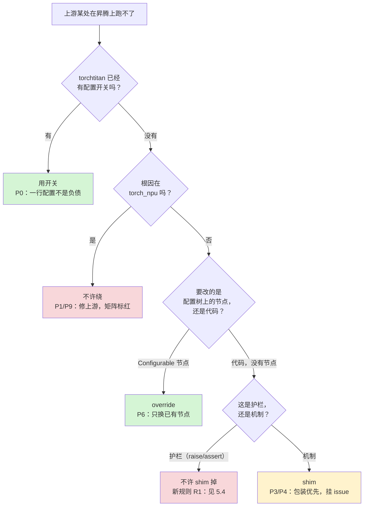

**这张图的四个出口，代价递增**：配置 < override < shim < 修上游。
每往右一步都要有理由，而且理由要写进代码里，不是写进 commit message。

---

## 3. 原理

### 3.1 为什么是两套机制，而不是一套

torchtitan 的可扩展点分两种，它们的**生命周期不同**，所以不能用同一套机制：

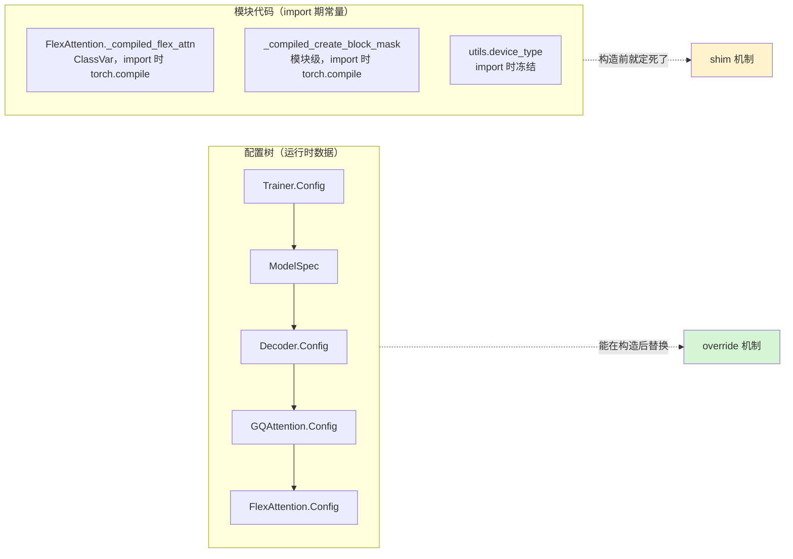

| | override | shim |
|---|---|---|
| 作用对象 | 配置树上的 `Configurable.Config` 节点 | 模块属性 / 类属性 |
| 时机 | 配置构造后、`build()` 前 | **第一次 `import torchtitan` 之前** |
| 用户可控 | ✅ `--override.imports` | ❌ 全局生效，只能用环境变量整条关掉 |
| 上游是否知情 | ✅ 上游自己的机制 | ❌ 猴补丁，上游随时可能挪走目标 |
| 负债性质 | 低——上游支持的扩展点 | 高——**每条都必须挂 issue，上游修好即删** |

### 3.2 分层

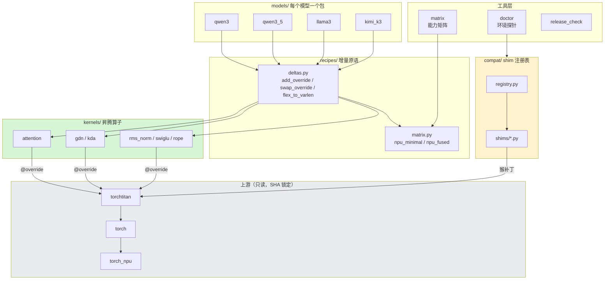

**依赖只能向下。** `kernels/` 不认识 `models/`；`recipes/deltas.py` 不认识具体模型；
模型的 `recipes.py` 逐条写出自己需要什么——**读那个函数就知道换了什么、没换什么**。

### 3.3 生命周期：一次训练启动

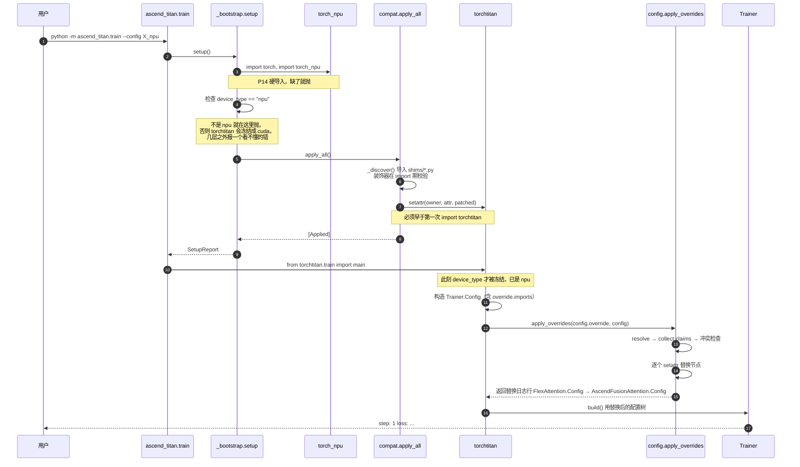

**这张图里唯一不能动的是顺序**：`torchtitan/tools/utils.py` 在 import 期就用
`torch._utils._get_available_device_type()` 把 `device_type` 冻死。
`setup()` 晚一步，整个训练就跑在 `cuda` 分支上。
`_bootstrap` 因此会检测"torchtitan 是否已被导入"并给出警告。

---

## 4. 具体设计

### 4.1 shim 注册表

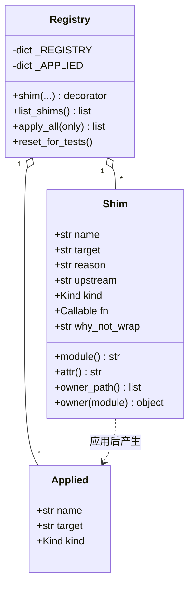

| 字段 | 含义 |
|---|---|
| `target` | `"module:attr"`，`attr` 可以是点分路径以触达类属性（`"pkg.mod:Class.attr"`） |
| `upstream` | 上游 issue/PR 的 URL，或 `draft:<path>#<anchor>` 指向 `docs/` 里已写好的正文 |
| `kind` | `wrap` / `replace` / `polyfill` |
| `fn(original)` | 收到当前属性，返回替换物；`wrap` 必须调用 `original` |
| `why_not_wrap` | `kind="replace"` 时必填 |

**注册期校验**（`shim()` 装饰器里，import 就跑，所以坏 shim 挂的是 CI 不是训练任务）：

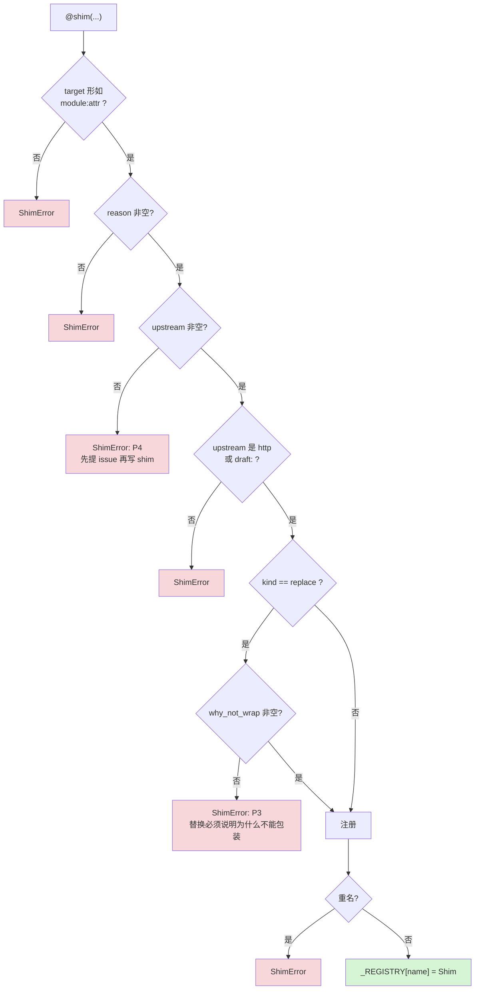

**三种 kind，语义不同**：

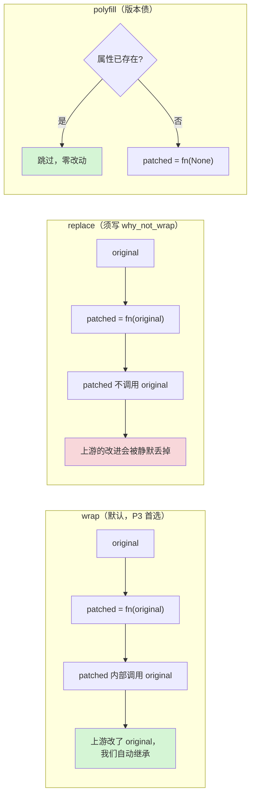

`polyfill` 的价值在于**它会自己消失**：上游长出这个属性，`apply_all` 直接跳过并记一条 INFO，
不需要任何代码改动。这是"消失条件"最理想的形态。

### 4.2 shim 的生命周期

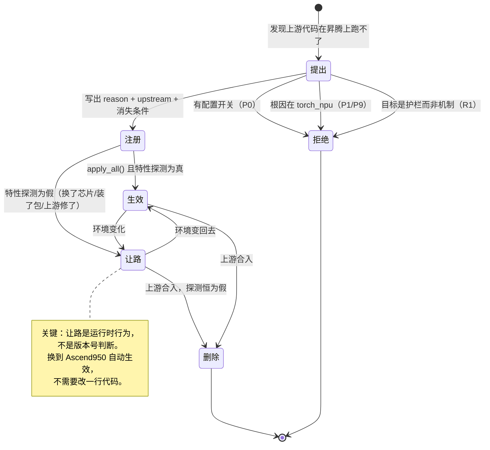

### 4.3 override：claim → 冲突检查 → 替换

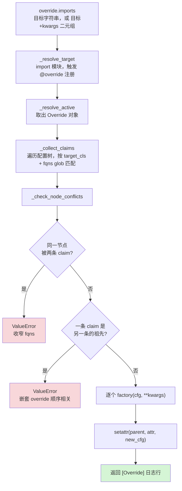

**先收集再改（collect-then-mutate）**：如果边遍历边替换，冲突就变成顺序相关的——
先跑的那条赢，而"先跑"取决于 `imports` 列表的顺序。收集完再检查，冲突是确定性的错误。

**两种冲突形态**：

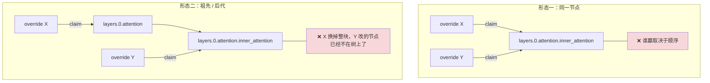

形态二是真实踩过的坑：上游 `fused_mla` 认领 `layers.N.attention`（整个注意力块），
它同时是 inner attention 与 RoPE 两个节点的祖先，所以我们那两条 override **都**得跳过，
不是只跳 RoPE。

**嵌套配置怎么换：`derive`**

当一个节点需要连同它的子节点一起换（KDA 就是：`InnerKDA.Config` 持有
`kernel: KDAKernel.Config`），不能写两条 override（会触发形态二），
而是**一条 override 在父节点上，用 `derive` 就地构造子节点**：

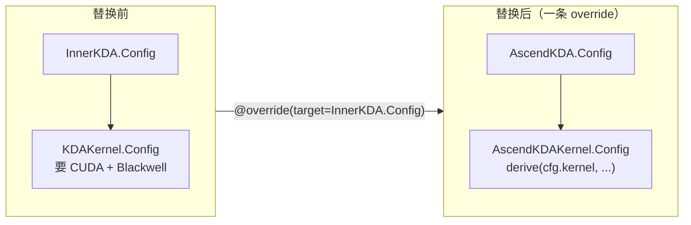

`derive` 的价值是**版本鲁棒**：目标 Config 以后长出新字段时，同名字段自动从 source 复制，
而不是静默退回默认值。工厂函数只写它真正要改的那几项。

### 4.4 门控（gate）：本项目最贵的一课

一条 shim / 一个增量什么时候生效，由**特性探测**决定。这里有三个独立的坑，我们三个都踩过。

#### 坑一：探果不探因

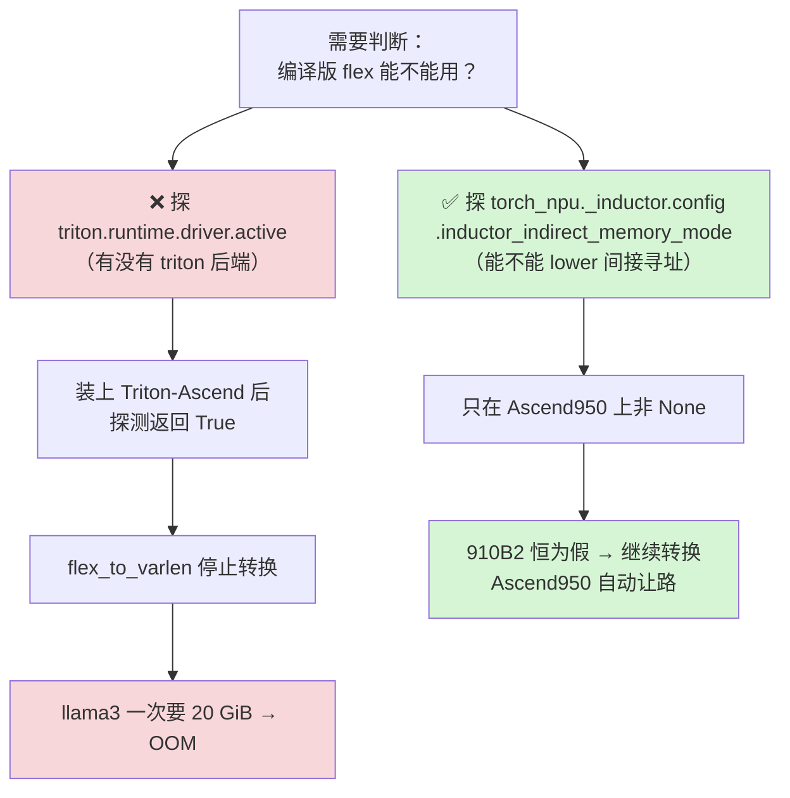

**规则**：探测必须指向**根因本身**。"有没有 triton 后端"和"能不能 lower document mask"
是两件事；把前者当后者，装个包就会把结论翻转过来。
修对这个探测之后，`3d_compile` 从红变绿——**同一个修正同时解决了假绿和假红**。

#### 坑二：判断时机

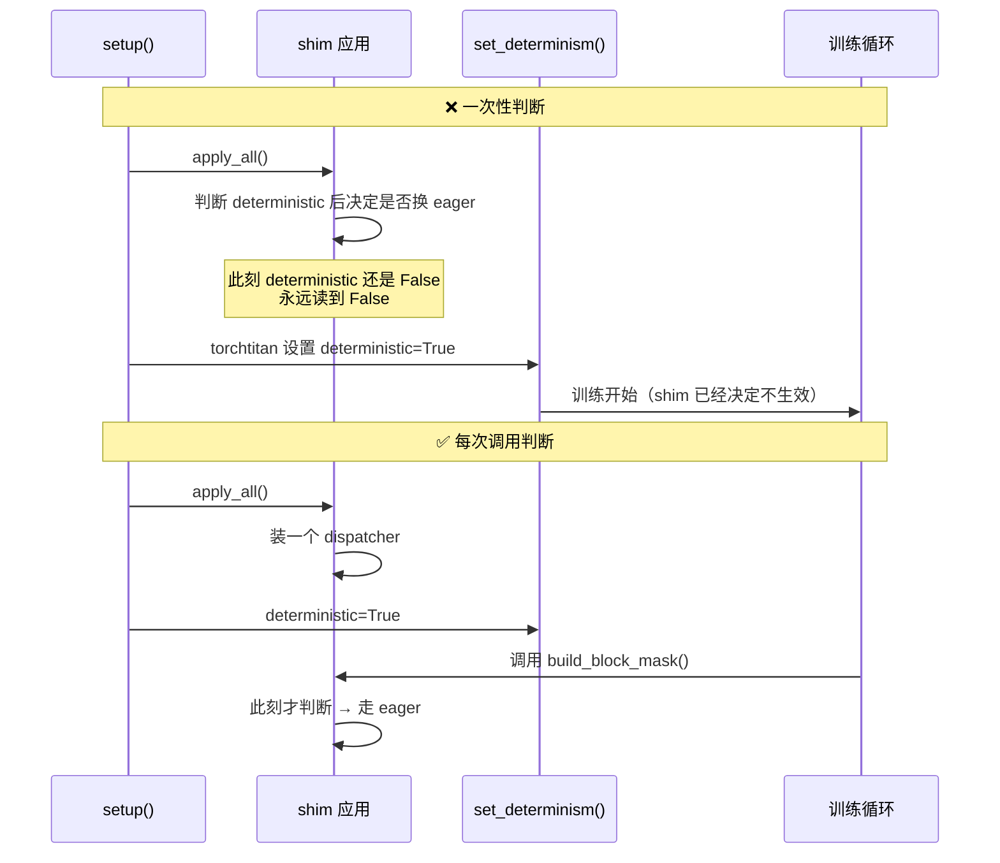

**规则**：shim 在 `setup()` 期应用，比 torchtitan 的大部分运行时状态都早。
凡是依赖运行时状态的门控，替换物必须是**分发器**，逐次调用判断。

#### 坑三：门开得太窄，等于没有

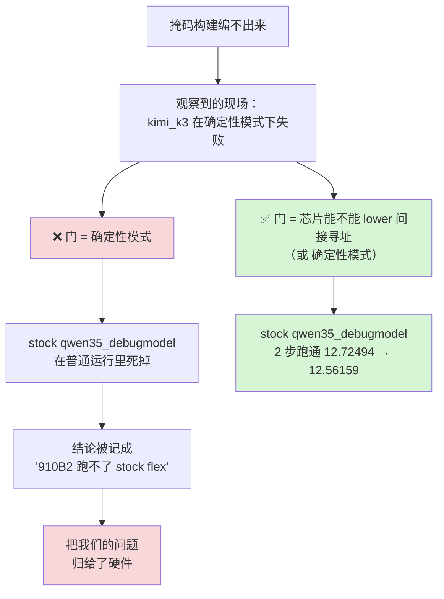

**规则**：门控条件要从**根因**推出来，不能从**观察到的现场**归纳。
kimi_k3 的掩码恰好不落在间接寻址那个模式里，所以它只在确定性模式下暴露；
拿单个模型的现象当芯片结论，是这次归因错误的全部原因。

---

## 5. 案例

### 5.1 注意力：一条链路，两个入口

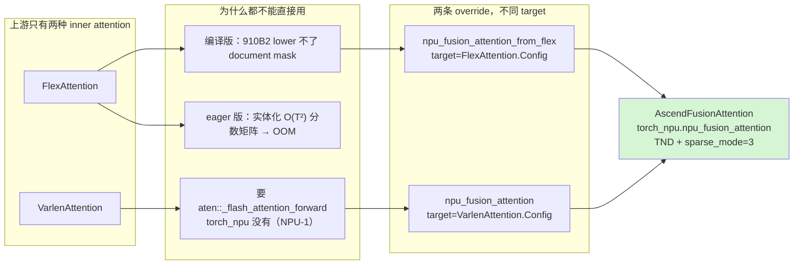

两条 override target 不同的 Config 类，**可以同时激活**——上游不同 flavor 的默认节点不一样。

### 5.2 CP：为什么这条 override 必须**不**生效

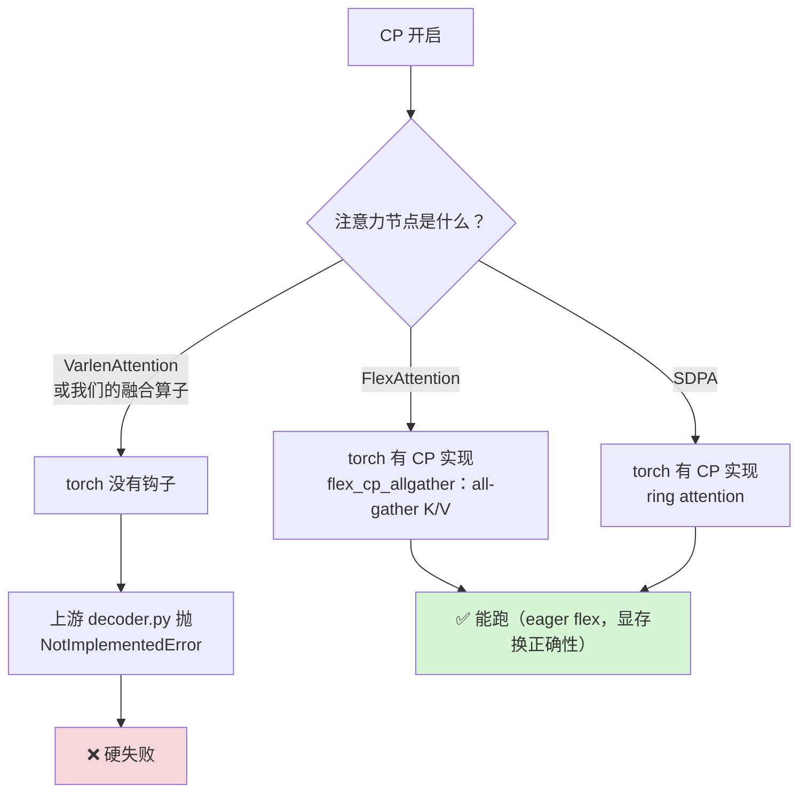

所以 `flex_to_varlen` 在 `context_parallel_degree > 1` 时**直接返回**：
非 CP 场景下救命的转换，在 CP 下只会把能跑的变成跑不了的。
**一个增量的适用条件，本身就是设计的一部分。**

### 5.3 GDN：一条 override 覆盖整棵子树

见 4.3 的 `derive` 图。要点：父子节点不能各写一条 override（形态二冲突），
父节点上一条 + `derive` 换子节点。

### 5.4 新规则 R1：护栏不许 shim 掉

这是本次评审新增的规则，起因是一个**差点做错的决定**。

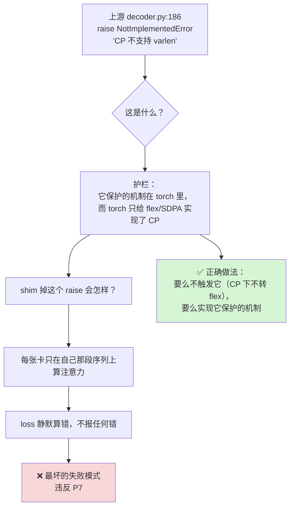

**R1：一处 `raise` / `assert` 是护栏还是机制，决定它能不能被 shim。**
护栏背后如果有未实现的机制，绕过它得到的不是"能跑了"，是"错得没有声音"。
判断方法：**问这个 raise 保护的东西在哪里实现**。找不到实现，就是护栏。

---

## 6. 决策记录

已有 ADR 见 `docs/adr/`。本文新增两条待立项决策：

### ADR-008（提案）：门控探测根因，不探代理信号

**Context.** `_flex_attention_is_usable()` 最初探 `triton.runtime.driver.active`。
装上 Triton-Ascend 后它返回 True，flex→varlen 转换停止，llama3 一次申请 20 GiB 而 OOM。

**Decision.** 特性探测必须指向根因本身可观测的开关。
本例是 `torch_npu._inductor.config.inductor_indirect_memory_mode`。

**Alternatives.**
- 版本号比较——被 P12 排除：版本号不描述硬件能力。
- 试跑一次再回退——代价不可控，且掩盖归因。

**Consequences.** 正面：换硬件自动让路，无需改代码；同一次修正让 `3d_compile` 从红转绿。
负面：探测点是上游私有属性，上游改名会失效——因此探测必须写在一个函数里，集中失效。

### ADR-009（提案）：护栏不可 shim

**Context.** 上游 CP 的 `NotImplementedError` 看起来像一条"限制"，删掉它就能跑。
实际它保护的机制（CP 下的注意力集合通信）在 torch 里只对 flex 与 SDPA 存在。

**Decision.** shim 不得移除 `raise` / `assert`，除非同时提供它保护的机制。

**Alternatives.** 删掉后跑通再说——被 P7 排除：结果是静默的错误 loss。

**Consequences.** 正面：杜绝一类无声的数值错误。
负面：某些能力要等我们自己实现机制（如让 CP 走融合算子），周期更长。

---

## 7. 风险与对策

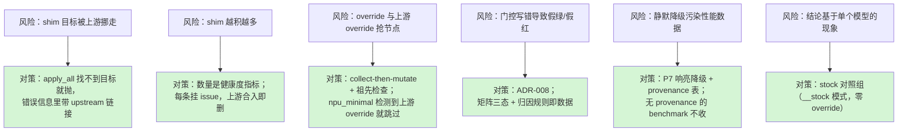

**R6 的对策值得单独说**：能力矩阵的每个格子都可以用 `__stock` 后缀跑一遍零 override 的对照。
这次把 CP 归因错误、TA-1 影响面、qwen3.5 的 MoE 能力三个结论纠正回来，靠的都是它。
**没有对照组，就分不清"上游的问题"和"我们的问题"。**

---

## 8. 度量

| 指标 | 现在 | 目标 | 来源 |
|---|--:|---|---|
| shim 数量 | 3（2 个文件） | → 0 | `list_shims()` |
| 其中 `kind=replace` | 2 | → 0（能包装就包装） | 同上 |
| 无消失条件的 shim | 0 | 0 | 人工评审 |
| 矩阵红格 | 13 / 61 | 只剩"上游按设计 CUDA-only" | `docs/matrix/` |
| 红格中归因"我们" | 0 | 0 | 同上 |
| 红格中归因 torch_npu | 0 | 0 | 同上 |

```bash
python -m ascend_titan.tools.doctor          # 打印已注册 shim
python -m ascend_titan.models.registry       # 打印模型支持状态
python -m ascend_titan.tools.matrix --list   # 打印能力矩阵用例
```

---

## 9. 迁移到 TorchTitanTurbo

机制与模型解耦，可以整体搬。建议顺序：

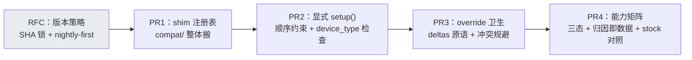

先搬 `compat/`（它零依赖、自带校验、价值最直观），再搬 `setup()` 的顺序约束——
后者是**最容易被忽略、代价最大**的一条：晚一步 import，整个训练跑在错误的 device 分支上。
